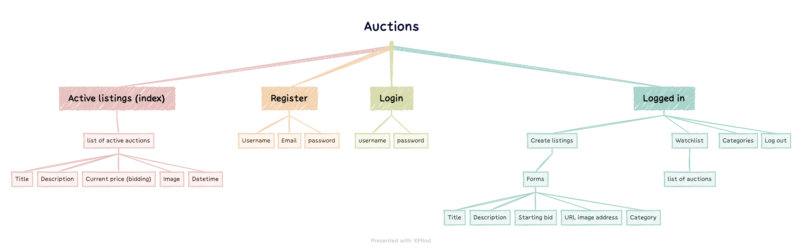
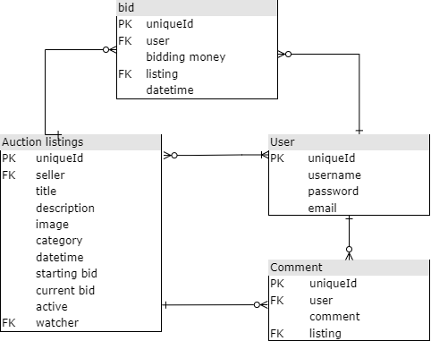
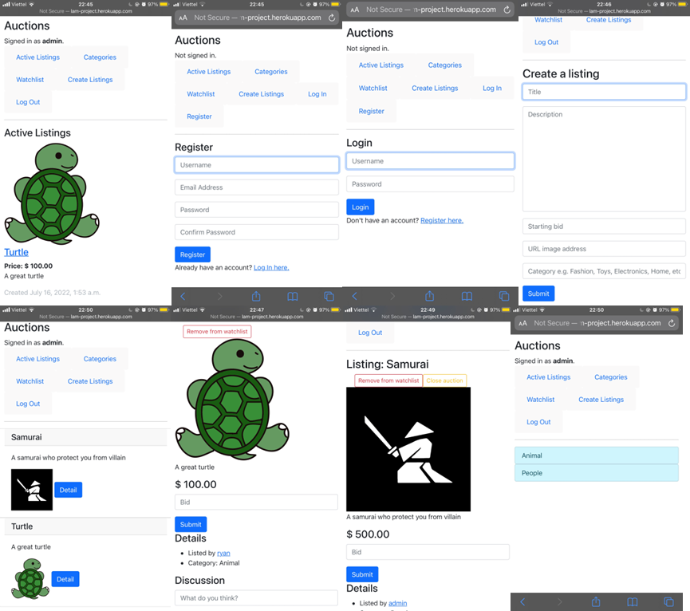

# **Commerce**

Design an eBay-like e-commerce auction site that will allow users to post auction listings, place bids on listings, comment on those listings, and add listings to a “watchlist.”

## Functionalities



- **Database Models**:
    - User
    - Auction listings
    - bids
    - comments
        
        
        
- **Create Listing**: You be able to visit a page to create a new listing.
    - can specify
        - a title for the listing
        - a text-based description
        - and what the starting bid should be.
    - You also optionally be able to provide a URL for an image for the listing and/or a category (e.g. Fashion, Toys, Electronics, Home, etc.).
- **Active Listings Page**: The default route of my web application are all of the currently active auction listings. Each active listing display the title, description, current price, and photo (if one exists for the listing).
- **Listing Page**: Clicking on a listing take you to a page specific to that listing. On that page, you will view all details about the listing, including the current price for the listing.
    - If  signed in
        - be able to add the item to their “Watchlist.” If the item is already on the watchlist → be able to remove it.
        - be able to bid on the item. The bid must be at least as large as the starting bid, and must be greater than any other bids that have been placed (if any). If the bid doesn’t meet those criteria, → be presented with an error.
        - If you are the one who created the listing, the user should have the ability to “close” the auction from this page, which makes the highest bidder the winner of the auction and makes the listing no longer active.
        - If you join in a closed listing page, and the user has won that auction, the page should say so.
        - you also be able to add comments to the listing page. The listing page should display all comments that have been made on the listing.
- **Watchlist**: If you are signed in, you be able to visit a Watchlist page, which should display all of the listings that a user has added to their watchlist. Clicking on any of those listings should take to that listing’s page.
- **Categories**: You be able to visit a page that displays a list of all listing categories. Clicking on the name of any category should take to a page that displays all of the active listings in that category.

## Installation

```python
pip install -r requirements.txt 
```

## Usage

```python
python manage.py runserver
```

## Demo

